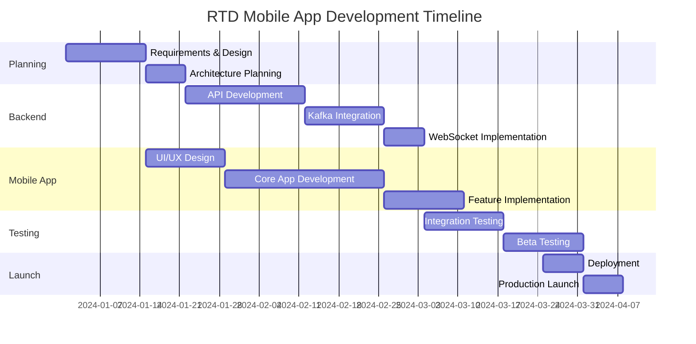

# RTD Live Rider App Development Plan
## Uber-like Real-time Transit Tracking Application

### Project Overview
Develop a mobile application that allows RTD riders to select buses and view live tracking on a map compared to their current GPS location, leveraging the existing Flink data pipeline as the primary data source.

### Phase 1: Requirements and Architecture (Weeks 1-2)

#### 1.1 User Requirements
**Core User Stories:**
- As a rider, I want to see all nearby buses on a map
- As a rider, I want to select a specific bus/route to track
- As a rider, I want to see real-time bus location vs my location
- As a rider, I want to know estimated arrival times
- As a rider, I want to receive notifications when my bus is approaching
- As a rider, I want to see bus occupancy levels (crowding info)
- As a rider, I want to plan my journey with multiple routes

**Advanced Features:**
- Real-time arrival predictions
- Service alerts and disruptions
- Accessibility information
- Offline mode for route planning
- Trip history and favorites
- Multi-language support

#### 1.2 Technical Architecture
```
┌─────────────────┐    ┌─────────────────┐    ┌─────────────────┐
│   Mobile App    │    │  Backend APIs   │    │ Flink Pipeline  │
│  (iOS/Android)  │◄──►│   (Node.js/     │◄──►│   (Existing)    │
│                 │    │    Spring Boot) │    │                 │
└─────────────────┘    └─────────────────┘    └─────────────────┘
         │                       │                       │
         ▼                       ▼                       ▼
┌─────────────────┐    ┌─────────────────┐    ┌─────────────────┐
│  User Location  │    │  Redis Cache    │    │  Kafka Topics   │
│   GPS Service   │    │   WebSockets    │    │   - vehicles    │
│                 │    │                 │    │   - alerts      │
└─────────────────┘    └─────────────────┘    └─────────────────┘
```

### Phase 2: Backend Development (Weeks 3-6)

#### 2.1 Real-time Data Integration
**Kafka Consumer Service:**
```javascript
// Node.js Kafka consumer for vehicle positions
const kafka = require('kafkajs');

class RTDDataConsumer {
  constructor() {
    this.kafka = kafka({
      clientId: 'rtd-rider-app',
      brokers: ['localhost:9092']
    });
    this.consumer = this.kafka.consumer({ groupId: 'rider-app-group' });
  }

  async consumeVehicleData() {
    await this.consumer.subscribe({ 
      topics: ['rtd.vehicle.positions', 'rtd.trip.updates', 'rtd.alerts'] 
    });
    
    await this.consumer.run({
      eachMessage: async ({ topic, partition, message }) => {
        const vehicleData = JSON.parse(message.value.toString());
        // Update Redis cache and push to WebSocket clients
        await this.updateVehicleCache(vehicleData);
        await this.broadcastToClients(vehicleData);
      },
    });
  }
}
```

#### 2.2 API Endpoints Design
**RESTful API Structure:**
```
GET    /api/v1/vehicles/nearby?lat={lat}&lon={lon}&radius={meters}
GET    /api/v1/vehicles/{vehicleId}/location
GET    /api/v1/routes/{routeId}/vehicles
GET    /api/v1/stops/nearby?lat={lat}&lon={lon}&radius={meters}
POST   /api/v1/users/{userId}/tracking/start
DELETE /api/v1/users/{userId}/tracking/stop
GET    /api/v1/alerts/active
WebSocket /ws/vehicle-updates/{vehicleId}
```

#### 2.3 Real-time Communication
**WebSocket Implementation:**
```javascript
// WebSocket service for real-time updates
class RTDWebSocketService {
  constructor(io) {
    this.io = io;
    this.userSessions = new Map();
  }

  handleConnection(socket) {
    socket.on('track-vehicle', (data) => {
      const { userId, vehicleId, userLocation } = data;
      this.userSessions.set(socket.id, { userId, vehicleId, userLocation });
      
      // Subscribe to vehicle updates
      this.subscribeToVehicle(socket, vehicleId);
    });

    socket.on('update-location', (userLocation) => {
      const session = this.userSessions.get(socket.id);
      if (session) {
        session.userLocation = userLocation;
        this.calculateAndSendETA(socket, session);
      }
    });
  }

  broadcastVehicleUpdate(vehicleData) {
    // Send updates to all clients tracking this vehicle
    this.io.emit(`vehicle-${vehicleData.vehicle_id}`, {
      location: {
        lat: vehicleData.latitude,
        lng: vehicleData.longitude
      },
      speed: vehicleData.speed,
      bearing: vehicleData.bearing,
      occupancy: vehicleData.occupancy_status,
      delay: vehicleData.delay_seconds,
      timestamp: vehicleData.timestamp_ms
    });
  }
}
```

### Phase 3: Mobile App Development (Weeks 4-8)

#### 3.1 Technology Stack
**React Native + TypeScript**
- Cross-platform development
- Native performance for maps
- Strong TypeScript integration
- Large community support

**Key Dependencies:**
```json
{
  "react-native-maps": "^1.8.0",
  "react-native-geolocation": "^3.0.0",
  "socket.io-client": "^4.7.0",
  "@react-navigation/native": "^6.1.0",
  "react-native-push-notification": "^8.1.0",
  "react-native-vector-icons": "^10.0.0"
}
```

#### 3.2 Core App Components

**Map Screen Component:**
```typescript
// MapScreen.tsx - Main tracking interface
interface VehicleLocation {
  vehicle_id: string;
  route_id: string;
  latitude: number;
  longitude: number;
  bearing: number;
  speed: number;
  occupancy_status: string;
  delay_seconds: number;
}

const MapScreen: React.FC = () => {
  const [userLocation, setUserLocation] = useState<Location | null>(null);
  const [trackedVehicle, setTrackedVehicle] = useState<VehicleLocation | null>(null);
  const [nearbyVehicles, setNearbyVehicles] = useState<VehicleLocation[]>([]);
  const [socket, setSocket] = useState<Socket | null>(null);

  useEffect(() => {
    // Initialize location tracking
    initializeLocationTracking();
    
    // Connect to WebSocket
    const newSocket = io('ws://localhost:3000');
    setSocket(newSocket);
    
    return () => newSocket.close();
  }, []);

  const trackVehicle = (vehicleId: string) => {
    if (socket && userLocation) {
      socket.emit('track-vehicle', {
        userId: 'user123',
        vehicleId,
        userLocation
      });
    }
  };

  return (
    <MapView
      style={styles.map}
      region={{
        latitude: userLocation?.latitude || 39.7392,
        longitude: userLocation?.longitude || -104.9903,
        latitudeDelta: 0.01,
        longitudeDelta: 0.01,
      }}
    >
      {/* User location marker */}
      {userLocation && (
        <Marker coordinate={userLocation} title="Your Location">
          <UserLocationIcon />
        </Marker>
      )}
      
      {/* Vehicle markers */}
      {nearbyVehicles.map(vehicle => (
        <VehicleMarker
          key={vehicle.vehicle_id}
          vehicle={vehicle}
          onPress={() => trackVehicle(vehicle.vehicle_id)}
        />
      ))}
      
      {/* Tracked vehicle with special styling */}
      {trackedVehicle && (
        <TrackedVehicleMarker vehicle={trackedVehicle} />
      )}
    </MapView>
  );
};
```

**Vehicle Selection Component:**
```typescript
// VehicleSelector.tsx - Route and vehicle selection
interface Route {
  route_id: string;
  route_short_name: string;
  route_long_name: string;
  vehicles: VehicleLocation[];
}

const VehicleSelector: React.FC = () => {
  const [routes, setRoutes] = useState<Route[]>([]);
  const [selectedRoute, setSelectedRoute] = useState<string | null>(null);

  return (
    <ScrollView style={styles.container}>
      {routes.map(route => (
        <RouteCard key={route.route_id} route={route}>
          {route.vehicles.map(vehicle => (
            <VehicleCard
              key={vehicle.vehicle_id}
              vehicle={vehicle}
              onSelect={() => trackVehicle(vehicle.vehicle_id)}
            />
          ))}
        </RouteCard>
      ))}
    </ScrollView>
  );
};
```

#### 3.3 Real-time Features Implementation

**ETA Calculation Service:**
```typescript
// ETAService.ts - Arrival time predictions
export class ETAService {
  static calculateETA(
    vehicleLocation: VehicleLocation,
    userLocation: Location,
    vehicleSpeed: number
  ): number {
    const distance = this.calculateDistance(
      vehicleLocation.latitude,
      vehicleLocation.longitude,
      userLocation.latitude,
      userLocation.longitude
    );
    
    // Account for stops, traffic, and average speed
    const adjustedSpeed = Math.max(vehicleSpeed * 0.7, 5); // Minimum 5 km/h
    const eta = (distance / adjustedSpeed) * 60; // Convert to minutes
    
    return Math.round(eta);
  }

  static calculateDistance(lat1: number, lon1: number, lat2: number, lon2: number): number {
    // Haversine formula for distance calculation
    const R = 6371; // Earth's radius in km
    const dLat = this.toRadians(lat2 - lat1);
    const dLon = this.toRadians(lon2 - lon1);
    
    const a = Math.sin(dLat/2) * Math.sin(dLat/2) +
      Math.cos(this.toRadians(lat1)) * Math.cos(this.toRadians(lat2)) *
      Math.sin(dLon/2) * Math.sin(dLon/2);
    
    const c = 2 * Math.atan2(Math.sqrt(a), Math.sqrt(1-a));
    return R * c;
  }
}
```

### Phase 4: Data Pipeline Integration (Weeks 6-7)

#### 4.1 Enhanced Flink Processing
**Real-time Enrichment Pipeline:**
```java
// EnhancedVehicleProcessor.java - Add rider-specific data
public class EnhancedVehicleProcessor extends KeyedProcessFunction<String, VehiclePosition, EnrichedVehicle> {
    
    private ValueState<VehiclePosition> lastPosition;
    private ValueState<Long> lastUpdateTime;
    
    @Override
    public void processElement(VehiclePosition vehicle, Context ctx, Collector<EnrichedVehicle> out) {
        VehiclePosition previous = lastPosition.value();
        Long lastUpdate = lastUpdateTime.value();
        
        EnrichedVehicle enriched = new EnrichedVehicle();
        enriched.setVehicleId(vehicle.getVehicleId());
        enriched.setLocation(vehicle.getLatitude(), vehicle.getLongitude());
        enriched.setBearing(vehicle.getBearing());
        enriched.setSpeed(vehicle.getSpeed());
        
        // Calculate derived metrics for riders
        if (previous != null) {
            double distanceTraveled = calculateDistance(previous, vehicle);
            long timeDiff = ctx.timestamp() - lastUpdate;
            enriched.setAverageSpeed(distanceTraveled / (timeDiff / 1000.0));
            enriched.setDirection(calculateDirection(previous, vehicle));
        }
        
        // Add crowd-sourced occupancy if available
        enriched.setOccupancyLevel(vehicle.getOccupancyStatus());
        enriched.setPassengerLoad(estimatePassengerLoad(vehicle));
        
        out.collect(enriched);
        
        // Update state
        lastPosition.update(vehicle);
        lastUpdateTime.update(ctx.timestamp());
    }
}
```

#### 4.2 Kafka Topic Structure for Mobile App
```yaml
# Additional Kafka topics for mobile app
rtd.mobile.vehicle-updates:
  partitions: 12
  replication: 3
  config:
    cleanup.policy: compact
    compression.type: gzip

rtd.mobile.user-requests:
  partitions: 6
  replication: 3
  config:
    retention.ms: 3600000  # 1 hour

rtd.mobile.eta-predictions:
  partitions: 8
  replication: 3
  config:
    cleanup.policy: compact
```

### Phase 5: Advanced Features (Weeks 8-10)

#### 5.1 Push Notifications
```typescript
// NotificationService.ts - Smart notifications
export class NotificationService {
  static scheduleArrivalNotification(vehicleId: string, eta: number) {
    // Schedule notification for 2 minutes before arrival
    const notificationTime = (eta - 2) * 60 * 1000;
    
    if (notificationTime > 0) {
      setTimeout(() => {
        PushNotification.localNotification({
          title: 'Bus Arriving Soon',
          message: `Your bus ${vehicleId} will arrive in 2 minutes`,
          playSound: true,
          soundName: 'default',
          actions: ['View', 'Dismiss']
        });
      }, notificationTime);
    }
  }

  static sendServiceAlert(alert: ServiceAlert) {
    PushNotification.localNotification({
      title: `Service Alert: ${alert.headerText}`,
      message: alert.descriptionText,
      priority: 'high',
      importance: 'high',
      actions: ['View Details', 'Dismiss']
    });
  }
}
```

#### 5.2 Offline Capabilities
```typescript
// OfflineService.ts - Offline route planning
export class OfflineService {
  private static STORAGE_KEY = 'rtd_offline_data';
  
  static async cacheRouteData(routes: Route[]) {
    await AsyncStorage.setItem(
      this.STORAGE_KEY,
      JSON.stringify({
        routes,
        cachedAt: Date.now(),
        version: '1.0'
      })
    );
  }
  
  static async getOfflineRoutes(): Promise<Route[] | null> {
    try {
      const cached = await AsyncStorage.getItem(this.STORAGE_KEY);
      if (cached) {
        const data = JSON.parse(cached);
        // Check if cache is less than 24 hours old
        if (Date.now() - data.cachedAt < 24 * 60 * 60 * 1000) {
          return data.routes;
        }
      }
      return null;
    } catch {
      return null;
    }
  }
}
```

### Phase 6: Testing and Quality Assurance (Weeks 10-11)

#### 6.1 Testing Strategy
**Unit Tests:**
```typescript
// __tests__/ETAService.test.ts
describe('ETAService', () => {
  test('calculates ETA correctly for nearby vehicle', () => {
    const vehicleLocation = { latitude: 39.7392, longitude: -104.9903 };
    const userLocation = { latitude: 39.7400, longitude: -104.9910 };
    const speed = 30; // km/h
    
    const eta = ETAService.calculateETA(vehicleLocation, userLocation, speed);
    expect(eta).toBeGreaterThan(0);
    expect(eta).toBeLessThan(60); // Should be less than 1 hour
  });
});
```

**Integration Tests:**
```typescript
// __tests__/WebSocketService.test.ts
describe('WebSocket Integration', () => {
  test('receives vehicle updates correctly', async () => {
    const mockSocket = new MockSocket();
    const service = new RTDWebSocketService(mockSocket);
    
    // Simulate vehicle data from Kafka
    const vehicleData = createMockVehicleData();
    service.broadcastVehicleUpdate(vehicleData);
    
    expect(mockSocket.lastEmit).toContain('vehicle-');
  });
});
```

#### 6.2 Performance Testing
```javascript
// Load testing for WebSocket connections
const loadTest = async () => {
  const connections = [];
  
  // Simulate 1000 concurrent users
  for (let i = 0; i < 1000; i++) {
    const socket = io('ws://localhost:3000');
    connections.push(socket);
    
    socket.emit('track-vehicle', {
      userId: `user${i}`,
      vehicleId: 'RTD_FF2_001',
      userLocation: generateRandomLocation()
    });
  }
  
  // Monitor memory usage and response times
  await new Promise(resolve => setTimeout(resolve, 60000));
  
  connections.forEach(socket => socket.disconnect());
};
```

### Phase 7: Deployment and Scaling (Weeks 11-12)

#### 7.1 Infrastructure Setup
```yaml
# docker-compose.yml for production deployment
version: '3.8'
services:
  rtd-api:
    build: ./backend
    ports:
      - "3000:3000"
    environment:
      - KAFKA_BROKERS=kafka:9092
      - REDIS_URL=redis:6379
    depends_on:
      - kafka
      - redis
    deploy:
      replicas: 3
  
  redis:
    image: redis:7-alpine
    ports:
      - "6379:6379"
    volumes:
      - redis_data:/data
  
  nginx:
    image: nginx:alpine
    ports:
      - "80:80"
      - "443:443"
    volumes:
      - ./nginx.conf:/etc/nginx/nginx.conf
      - ./ssl:/etc/nginx/ssl
```

#### 7.2 Monitoring and Alerting
```javascript
// Monitoring dashboard for app performance
const monitoring = {
  activeUsers: () => websocketConnections.size,
  vehicleUpdatesPerSecond: () => vehicleUpdateCounter / 60,
  averageLatency: () => latencyMetrics.average(),
  errorRate: () => errorCounter / totalRequests
};

// Alert thresholds
const alerts = {
  highLatency: monitoring.averageLatency() > 500, // ms
  highErrorRate: monitoring.errorRate() > 0.05,   // 5%
  tooManyUsers: monitoring.activeUsers() > 5000
};
```

### Phase 8: Launch and Iteration (Week 12+)

#### 8.1 Beta Testing Program
- Release to RTD employees first
- Gradual rollout to select routes (FF2, A, E lines)
- Collect user feedback and performance metrics
- A/B testing for UI/UX improvements

#### 8.2 Analytics and Optimization
```typescript
// Analytics tracking for app usage
export class AnalyticsService {
  static trackVehicleSelection(routeId: string, vehicleId: string) {
    // Track which routes/vehicles are most popular
    analytics.track('vehicle_selected', {
      route_id: routeId,
      vehicle_id: vehicleId,
      timestamp: Date.now()
    });
  }
  
  static trackETAAccuracy(predicted: number, actual: number) {
    // Monitor ETA prediction accuracy
    const accuracy = Math.abs(predicted - actual) / actual;
    analytics.track('eta_accuracy', { accuracy });
  }
}
```

## User Interface Design

### Main Screens

#### 1. Map View (Primary Screen)
```
┌─────────────────────────┐
│  [Search]  [Filter] [☰] │ Header
├─────────────────────────┤
│                         │
│    [Map with buses]     │ Interactive Map
│         📍              │ - User location
│     🚌  🚌  🚌         │ - Bus markers
│                         │
├─────────────────────────┤
│ Next Bus: FF2          │ Quick Info
│ ETA: 5 min | 2 stops   │ Panel
└─────────────────────────┘
```

#### 2. Route Selection
```
┌─────────────────────────┐
│  Select Route      [X]  │
├─────────────────────────┤
│ Popular Routes          │
│ ┌─────────────────────┐ │
│ │ FF2 - Flatiron Flyer│ │
│ │ 3 buses nearby      │ │
│ └─────────────────────┘ │
│ ┌─────────────────────┐ │
│ │ A Line              │ │
│ │ Next: 12 min        │ │
│ └─────────────────────┘ │
└─────────────────────────┘
```

#### 3. Vehicle Details
```
┌─────────────────────────┐
│  Bus #1234 - Route FF2  │
├─────────────────────────┤
│ Status: In Transit      │
│ Occupancy: 🟢 Low       │
│ Speed: 35 mph           │
│ Delay: +2 min           │
├─────────────────────────┤
│ Your Location ────●──── │ Progress Bar
│                   ↓     │
│ Next Stop: Table Mesa   │
│ ETA: 3 minutes          │
├─────────────────────────┤
│ [Track This Bus]        │
└─────────────────────────┘
```

## Budget and Resource Allocation

### Development Team:
| Role | Duration | Cost |
|------|----------|------|
| Project Manager | 12 weeks | $15,000 |
| Backend Developer | 10 weeks | $40,000 |
| Mobile Developer | 8 weeks | $35,000 |
| DevOps Engineer | 4 weeks | $15,000 |
| QA Engineer | 6 weeks | $18,000 |
| UI/UX Designer | 4 weeks | $12,000 |
| **Total Development** | | **$135,000** |

### Infrastructure Costs (Annual):
| Service | Annual Cost |
|---------|-------------|
| Cloud hosting (AWS/GCP) | $12,000 |
| Mobile app stores | $200 |
| Push notification service | $2,400 |
| SSL certificates | $300 |
| Monitoring tools | $3,600 |
| **Total Operating** | **$18,500** |

## Success Metrics

### User Engagement KPIs:
- **Daily Active Users**: > 1,000 (10% of regular RTD riders)
- **Session Duration**: > 5 minutes average
- **Return Usage Rate**: > 60% weekly
- **User Ratings**: > 4.0 stars

### Technical Performance Metrics:
- **App Load Time**: < 2 seconds
- **Real-time Update Latency**: < 1 second
- **System Uptime**: 99.5%
- **ETA Accuracy**: Within 2 minutes (90% of the time)
- **Crash-free Rate**: > 99%

### Business Impact Metrics:
- **Ridership Increase**: 5% within first year
- **Wait Time Reduction**: 15% average
- **Customer Satisfaction**: +10 NPS points
- **Operational Insights**: 100% route coverage

## Risk Assessment and Mitigation

### Technical Risks:
| Risk | Impact | Mitigation |
|------|--------|------------|
| Kafka stream failure | High | Implement Redis cache fallback |
| GPS accuracy issues | Medium | Use cell tower triangulation backup |
| Network connectivity | High | Offline mode with cached routes |
| Scalability bottleneck | Medium | Auto-scaling infrastructure |

### Business Risks:
| Risk | Impact | Mitigation |
|------|--------|------------|
| Low user adoption | High | Marketing campaign, incentives |
| Data privacy concerns | Medium | Clear privacy policy, opt-in features |
| Competition from Google Maps | Medium | RTD-specific features, integration |
| Budget overrun | Low | Phased development, MVP first |

## Future Enhancements

### Version 2.0 Features:
1. **Multimodal Journey Planning**
   - Combine bus, light rail, bike-share
   - Door-to-door navigation
   - Fare calculation

2. **Social Features**
   - Share trip with friends/family
   - Crowdsourced delay reports
   - Community alerts

3. **Accessibility Features**
   - Voice navigation
   - High-contrast mode
   - Wheelchair-accessible routing

4. **Smart Predictions**
   - ML-based ETA improvements
   - Crowd prediction
   - Weather impact analysis

5. **Integration Opportunities**
   - Mobile ticketing
   - Uber/Lyft last-mile
   - Park-and-ride availability

## Implementation Timeline



## Conclusion

This RTD Live Rider App will transform the public transit experience in Denver by providing Uber-like real-time tracking capabilities. By leveraging the existing Flink data pipeline infrastructure, the app can deliver accurate, real-time vehicle positions with minimal additional infrastructure investment.

The phased development approach ensures that core functionality is delivered quickly while allowing for iterative improvements based on user feedback. With a total development cost of $135,000 and annual operating costs of $18,500, the project represents a cost-effective solution for modernizing RTD's rider experience.

Success will be measured through increased ridership, reduced wait times, and improved customer satisfaction scores, positioning RTD as a leader in smart transit solutions.