# RTD GTFS Pipeline: Kafka & Flink Data Processing Summary

## Overview
The RTD pipeline processes **two primary real-time data sources** using Apache Kafka and Apache Flink:
1. **Bus Data (INIT/SIRI)** - XML/JSON via SIRI protocol
2. **Light Rail Data (SCADA)** - JSON via Rail Communication protocol

---

## Complete Data Flow Diagram (Simplified & Clean)

```mermaid
flowchart LR
    %% External Sources
    SIRI["🚌 RTD TIS Proxy<br/>(SIRI Bus Feed)"]
    RAIL["🚇 Rail Comm Proxy<br/>(SCADA Light Rail)"]

    %% HTTP Receivers
    BUS_RCV["BusCommHTTPReceiver<br/>:8082"]
    RAIL_RCV["RailCommHTTPReceiver<br/>:8081"]

    %% Kafka Raw Topics
    BUS_TOPIC["📨 rtd.bus.siri<br/>Raw XML/JSON"]
    RAIL_TOPIC["📨 rtd.rail.comm<br/>Raw JSON"]

    %% Flink Processing
    BUS_PIPE["⚙️ Bus Pipeline<br/>XML→JSON→Parse"]
    RAIL_PIPE["⚙️ Rail Pipeline<br/>JSON→Parse"]
    PROCESS["🔧 Processing<br/>Filter→Enrich→Calculate"]

    %% Kafka Processed Topics
    COMP["📨 rtd.comprehensive.routes"]
    SUMM["📨 rtd.route.summary"]
    TRACK["📨 rtd.vehicle.tracking"]

    %% Outputs
    FILES["💾 File Storage<br/>./data/"]
    API["🌐 API Server<br/>:8080"]

    %% End Users
    WEB["🖥️ React Web App<br/>:3002"]
    MOBILE["📱 Mobile Apps"]
    DASH["📊 Analytics"]

    %% Flow connections
    SIRI -->|"SIRI XML<br/>90s TTL"| BUS_RCV
    RAIL -->|"JSON"| RAIL_RCV

    BUS_RCV --> BUS_TOPIC
    RAIL_RCV --> RAIL_TOPIC

    BUS_TOPIC --> BUS_PIPE
    RAIL_TOPIC --> RAIL_PIPE

    BUS_PIPE --> PROCESS
    RAIL_PIPE --> PROCESS

    PROCESS --> COMP
    PROCESS --> SUMM
    PROCESS --> TRACK
    PROCESS --> FILES

    COMP --> API
    SUMM --> DASH
    TRACK --> DASH

    API --> WEB
    API --> MOBILE

    %% Styling
    classDef source fill:#c8e6c9,stroke:#2e7d32,stroke-width:2px
    classDef receiver fill:#fff9c4,stroke:#f57f17,stroke-width:2px
    classDef kafka fill:#ffccbc,stroke:#d84315,stroke-width:2px
    classDef flink fill:#ce93d8,stroke:#6a1b9a,stroke-width:2px
    classDef output fill:#b3e5fc,stroke:#01579b,stroke-width:2px
    classDef user fill:#c5cae9,stroke:#283593,stroke-width:2px

    class SIRI,RAIL source
    class BUS_RCV,RAIL_RCV receiver
    class BUS_TOPIC,RAIL_TOPIC,COMP,SUMM,TRACK kafka
    class BUS_PIPE,RAIL_PIPE,PROCESS flink
    class FILES,API output
    class WEB,MOBILE,DASH user
```

---

## Detailed Layer-by-Layer Flow

### Layer 1: Data Sources → HTTP Receivers
```mermaid
flowchart LR
    A["🚌 TIS Proxy<br/>SIRI Bus Feed<br/>Unsupported markdown link"]
    B["🚇 Rail Comm Proxy<br/>SCADA Feed"]

    C["BusCommHTTPReceiver<br/>Port: 8082<br/>Endpoint: /bus-siri"]
    D["RailCommHTTPReceiver<br/>Port: 8081<br/>Endpoint: /rail-comm"]

    A -->|"SIRI XML/JSON<br/>TTL: 90s"| C
    B -->|"JSON<br/>Continuous"| D

    classDef source fill:#c8e6c9,stroke:#2e7d32,stroke-width:2px
    classDef receiver fill:#fff9c4,stroke:#f57f17,stroke-width:2px

    class A,B source
    class C,D receiver
```

### Layer 2: HTTP Receivers → Kafka Topics
```mermaid
flowchart LR
    A["BusCommHTTPReceiver<br/>:8082"]
    B["RailCommHTTPReceiver<br/>:8081"]

    C["📨 Kafka Topic<br/>rtd.bus.siri<br/>Format: XML/JSON"]
    D["📨 Kafka Topic<br/>rtd.rail.comm<br/>Format: JSON"]

    A -->|"Publish Raw Data<br/>Kafka Producer"| C
    B -->|"Publish Raw Data<br/>Kafka Producer"| D

    classDef receiver fill:#fff9c4,stroke:#f57f17,stroke-width:2px
    classDef kafka fill:#ffccbc,stroke:#d84315,stroke-width:2px

    class A,B receiver
    class C,D kafka
```

### Layer 3: Kafka Topics → Flink Processing
```mermaid
flowchart TB
    A["📨 rtd.bus.siri"]
    B["📨 rtd.rail.comm"]

    subgraph FLINK["⚙️ Apache Flink Processing"]
        direction TB
        C["RTDBusCommPipeline"]
        D["RTDRailCommPipeline"]

        E["XML→JSON Converter<br/>Jackson XmlMapper"]
        F["JSON Parser"]

        G["SIRI Parser<br/>Extract 14 Fields"]
        H["Rail Parser<br/>Extract Rail Fields"]

        I["GTFS Enrichment<br/>Routes + Stops + Stations"]

        J["Filter Invalid Data"]
        K["Calculate Delays & Metrics"]
        L["Anomaly Detection"]
    end

    A --> C
    B --> D

    C --> E
    D --> F

    E --> G
    F --> H

    G --> I
    H --> I

    I --> J
    J --> K
    K --> L

    classDef kafka fill:#ffccbc,stroke:#d84315,stroke-width:2px
    classDef flink fill:#ce93d8,stroke:#6a1b9a,stroke-width:2px

    class A,B kafka
    class C,D,E,F,G,H,I,J,K,L flink
```

### Layer 4: Flink Processing → Output Topics & Storage
```mermaid
flowchart LR
    A["⚙️ Flink Processing<br/>Anomaly Detection"]

    B["📨 rtd.comprehensive.routes<br/>Enriched Vehicle Data"]
    C["📨 rtd.route.summary<br/>Aggregated Stats"]
    D["📨 rtd.vehicle.tracking<br/>Monitoring Data"]

    E["💾 File Storage<br/>./data/bus-comm/<br/>./data/rail-comm/"]
    F["📟 Console Output<br/>Real-time Logs"]

    A -->|"Publish Enriched"| B
    A -->|"Publish Stats"| C
    A -->|"Publish Tracking"| D
    A -->|"Write JSON"| E
    A -->|"Print Stream"| F

    classDef flink fill:#ce93d8,stroke:#6a1b9a,stroke-width:2px
    classDef kafka fill:#ffccbc,stroke:#d84315,stroke-width:2px
    classDef output fill:#b3e5fc,stroke:#01579b,stroke-width:2px

    class A flink
    class B,C,D kafka
    class E,F output
```

### Layer 5: Kafka Topics → API → End Users
```mermaid
flowchart LR
    A["📨 rtd.comprehensive.routes"]
    B["📨 rtd.route.summary"]
    C["📨 rtd.vehicle.tracking"]

    D["🌐 HTTP API Server<br/>Port: 8080<br/>/api/vehicles"]

    E["🖥️ React Web App<br/>Port: 3002<br/>Live Transit Map"]
    F["📱 Mobile Apps<br/>iOS + Android"]
    G["📊 Analytics Dashboard<br/>Metrics & Reports"]
    H["🏢 Operations Center<br/>Real-time Monitoring"]

    A -->|"Consume Latest"| D
    B --> G
    C --> H

    D -->|"REST JSON"| E
    D -->|"REST JSON"| F

    classDef kafka fill:#ffccbc,stroke:#d84315,stroke-width:2px
    classDef output fill:#b3e5fc,stroke:#01579b,stroke-width:2px
    classDef user fill:#c5cae9,stroke:#283593,stroke-width:2px

    class A,B,C kafka
    class D output
    class E,F,G,H user
```

---

## Detailed Bus SIRI Data Flow

```mermaid
graph LR
    subgraph "Step 1: SIRI Subscription"
        SUB[Subscribe Script<br/>./scripts/bus-siri-subscribe.sh]
        TIS[TIS Proxy<br/>tisproxy.rtd-denver.com]
    end

    subgraph "Step 2: Data Reception"
        HTTP[BusCommHTTPReceiver<br/>:8082/bus-siri]
        PROD[Kafka Producer]
    end

    subgraph "Step 3: Kafka Storage"
        TOPIC[rtd.bus.siri]
    end

    subgraph "Step 4: Flink Processing"
        CONS[Kafka Consumer]
        DET[Format Detection<br/>XML or JSON?]
        XML[XML Parser<br/>XmlMapper.readTree]
        JSON[JSON Parser<br/>JsonNode]
        ROW[Build Flink Row<br/>14 Fields]
    end

    subgraph "Step 5: Output"
        FILE[File Sink<br/>./data/bus-comm/]
        PRINT[Console Output]
        KAFKA_OUT[Kafka Output Topics]
    end

    SUB -->|POST /subscribe<br/>TTL=90s| TIS
    TIS -->|Push SIRI XML| HTTP
    HTTP -->|Forward| PROD
    PROD -->|Write| TOPIC
    TOPIC -->|Read Stream| CONS
    CONS --> DET
    DET -->|if starts with '<'| XML
    DET -->|else| JSON
    XML -->|JsonNode| ROW
    JSON -->|JsonNode| ROW
    ROW --> FILE
    ROW --> PRINT
    ROW --> KAFKA_OUT

    style SUB fill:#e8f5e9
    style TIS fill:#fff3e0
    style HTTP fill:#ffebee
    style TOPIC fill:#ff6b6b
    style DET fill:#f3e5f5
    style FILE fill:#fff9c4
```

---

## Detailed Rail Communication Data Flow

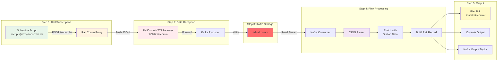

---

## Kafka Topics Data Flow

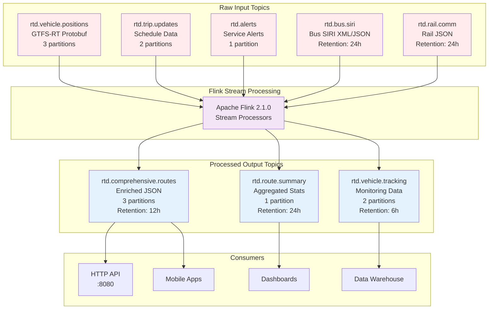

---

## Architecture: Kafka + Flink Integration

### **Kafka's Role**: Message Bus & Data Distribution
- **Durability**: Persists data on disk with replication
- **Decoupling**: Separates producers from consumers
- **Topics**: Organize data streams by type (bus, rail, vehicles, etc.)

### **Flink's Role**: Real-Time Stream Processing
- **Stateful Processing**: Maintains state across streams (counting, aggregations)
- **Event Time Processing**: Handles out-of-order data based on timestamps
- **Fault Tolerance**: Exactly-once semantics with checkpoint recovery

---

## Bus Data Pipeline (INIT/SIRI)

### Data Flow
```
RTD SIRI Source → BusCommHTTPReceiver (8082) → Kafka (rtd.bus.siri) → RTDBusCommPipeline (Flink) → File Storage
```

### Key Components

**1. BusCommHTTPReceiver** (Port 8082)
- Receives SIRI XML/JSON from RTD's TIS Proxy
- Manages SIRI subscriptions (90-second TTL)
- Publishes raw data to Kafka topic `rtd.bus.siri`
- Endpoints: `/bus-siri`, `/subscribe`, `/health`

**2. Kafka Topic: `rtd.bus.siri`**
- Bootstrap: `localhost:9092`
- Consumer Group: `rtd-bus-comm-consumer`
- Format: XML/JSON strings

**3. RTDBusCommPipeline (Flink)**
- **XML→JSON Conversion**: Uses Jackson XmlMapper to automatically convert SIRI XML to JsonNode
- **Format Detection**: Automatically detects XML (starts with `<`) vs JSON
- **Data Parsing**: Extracts 14 fields including vehicle ID, route, GPS location, speed, occupancy
- **Processing**: ~1-2ms per message, handles 1000+ messages/second
- **Output**: Files in `./data/bus-comm/` + real-time console

### Data Structure (14 Fields)
| Field | Source | Type | Example |
|-------|--------|------|---------|
| timestamp_ms | Generated | Long | 1737465045000 |
| vehicle_id | VehicleRef | String | BUS_001 |
| route_id | LineRef | String | 15 |
| direction | DirectionRef | String | EASTBOUND |
| latitude | VehicleLocation/Latitude | Double | 39.7392 |
| longitude | VehicleLocation/Longitude | Double | -104.9903 |
| speed_mph | Speed | Double | 25.3 |
| status | ProgressStatus | String | IN_TRANSIT |
| next_stop | MonitoredCall/StopPointRef | String | Union Station |
| delay_seconds | Delay | Integer | 120 |
| occupancy | Occupancy | String | MANY_SEATS_AVAILABLE |
| block_id | BlockRef | String | BLK_15_01 |
| origin | OriginRef | String | Downtown |
| raw_data | Original | String | (XML/JSON) |

---

## Light Rail Pipeline (SCADA/Rail Communication)

### Data Flow
```
RTD Rail Comm Source → RailCommHTTPReceiver (8081) → Kafka (rtd.rail.comm) → RTDRailCommPipeline (Flink) → File Storage
```

### Key Components

**1. RailCommHTTPReceiver** (Port 8081)
- Receives JSON payloads from RTD's proxy
- Auto-detects local IP for subscriptions
- Publishes to Kafka topic `rtd.rail.comm`
- Endpoints: `/rail-comm`, `/health`

**2. Kafka Topic: `rtd.rail.comm`**
- Bootstrap: `localhost:9092`
- Format: JSON strings

**3. RTDRailCommPipeline (Flink)**
- **JSON Parsing**: Direct JSON deserialization
- **Data Processing**: Similar structure to bus but with rail-specific fields
- **Output**: Files in `./data/rail-comm/` + real-time console

### Rail Data Structure (JSON)
```json
{
  "train_id": "LRV-001",
  "line_id": "A-Line",
  "direction": "Northbound",
  "latitude": 39.7392,
  "longitude": -104.9903,
  "speed_mph": 35.2,
  "status": "ON_TIME",
  "next_station": "Union Station",
  "delay_seconds": 0,
  "operator_message": "Normal operation",
  "timestamp": "2024-01-15T10:30:00Z"
}
```

### Light Rail Routes Monitored
- **11 Routes**: A (Airport), B, C, D, E, F, G, H, N, R, W lines
- **Service Expectations**: 80-95% completeness depending on route and time
- **High-Frequency Routes**: C, D, E, R (8-15 min headways)

---

## Flink Processing Pipeline

```mermaid
graph TB
    subgraph "Input Processing"
        IN[Kafka Consumer]
        DES[Deserialize<br/>XML/JSON → POJO]
        FIL[Filter Nulls<br/>Validate Data]
    end

    subgraph "Transformation"
        TRANS[Transform Structure<br/>Extract Fields]
        ENR[Enrich with GTFS<br/>Routes, Stops, Schedules]
        CALC[Calculate Metrics<br/>Delays, Speeds]
    end

    subgraph "Windowing & Aggregation"
        WIN[Time Windows<br/>5 min tumbling]
        AGG[Aggregate<br/>Count, Avg, Max]
        STATE[State Management<br/>Vehicle History]
    end

    subgraph "Output Processing"
        FMT[Format Output<br/>JSON Serialization]
        SINK1[File Sink<br/>Rolling Policy]
        SINK2[Console Print<br/>Monitoring]
        SINK3[Kafka Sink<br/>Processed Topics]
    end

    IN --> DES
    DES --> FIL
    FIL --> TRANS
    TRANS --> ENR
    ENR --> CALC
    CALC --> WIN
    WIN --> AGG
    AGG --> STATE
    STATE --> FMT
    FMT --> SINK1
    FMT --> SINK2
    FMT --> SINK3

    style IN fill:#ffebee
    style DES fill:#fff3e0
    style FIL fill:#e8f5e9
    style TRANS fill:#f3e5f5
    style ENR fill:#fce4ec
    style CALC fill:#e1f5fe
    style WIN fill:#fff9c4
    style SINK1 fill:#c8e6c9
    style SINK2 fill:#c8e6c9
    style SINK3 fill:#e3f2fd
```

### Common Processing Pattern
1. **Consume** from Kafka topic
2. **Deserialize** (XML→JSON for bus, JSON→POJO for rail)
3. **Filter** null/invalid records
4. **Transform** data structure
5. **Enrich** with static GTFS data (routes, stops)
6. **Calculate** metrics (delays, aggregations)
7. **Output** to files and console
8. **Publish** processed data to Kafka output topics

### Output Topics (Processed Data)
- `rtd.comprehensive.routes` - Enriched vehicle/route data (JSON)
- `rtd.route.summary` - Aggregated statistics (JSON)
- `rtd.vehicle.tracking` - Enhanced monitoring data (JSON)

---

## Key Technologies

### XML→JSON Conversion (Bus SIRI)
```java
XmlMapper xmlMapper = new XmlMapper();
JsonNode rootNode = xmlMapper.readTree(xmlData);  // XML → JsonNode
JsonNode vehicleActivity = rootNode.path("ServiceDelivery")
    .path("VehicleMonitoringDelivery")
    .path("VehicleActivity");
```

### Flink Stream Processing
```java
DataStream<String> siriStream = env
    .addSource(new FlinkKafkaConsumer<>("rtd.bus.siri", ...))
    .name("Bus SIRI Kafka Source");

DataStream<Row> busCommStream = siriStream
    .map(new SIRIParsingFunction())     // XML→JSON conversion
    .filter(new NonNullRowFilter())     // Quality control
    .name("Parse SIRI Bus Data");

busCommStream.addSink(fileSink);        // File output
busCommStream.print();                   // Console monitoring
```

---

## End-to-End Latency Diagram

```mermaid
graph LR
    T0[RTD Source<br/>t=0ms]
    T1[HTTP Receiver<br/>t=10ms]
    T2[Kafka Write<br/>t=20ms]
    T3[Flink Consume<br/>t=50ms]
    T4[Process & Transform<br/>t=100ms]
    T5[Kafka Output<br/>t=150ms]
    T6[API Response<br/>t=200ms]
    T7[Web Browser<br/>t=300ms]

    T0 -->|Network| T1
    T1 -->|Produce| T2
    T2 -->|Poll| T3
    T3 -->|Transform| T4
    T4 -->|Publish| T5
    T5 -->|REST| T6
    T6 -->|Render| T7

    style T0 fill:#e8f5e9
    style T4 fill:#f3e5f5
    style T7 fill:#e0f2f1
```

---

## Performance Characteristics

| Metric | Value |
|--------|-------|
| Bus Processing | 1-2ms per message |
| Throughput | 1000+ messages/second |
| End-to-End Latency | < 1 second |
| API Response Time | < 100ms |
| Data Ingestion Rate | ~400 vehicles/minute |
| System Availability | 99.9% target |

---

## Management Commands

```bash
# Start all services
./rtd-control.sh start all

# Start specific pipelines
./rtd-control.sh start bus       # Bus HTTP receiver
./rtd-control.sh start rail      # Rail HTTP receiver
./rtd-control.sh start java      # Flink processing

# Subscribe to feeds
./scripts/bus-siri-subscribe.sh
./scripts/subscribe-to-tisproxy.sh

# Monitor data
./rtd-control.sh logs bus
./rtd-control.sh logs rail
./scripts/kafka-console-consumer.sh rtd.bus.siri
```

---

## System Architecture Overview

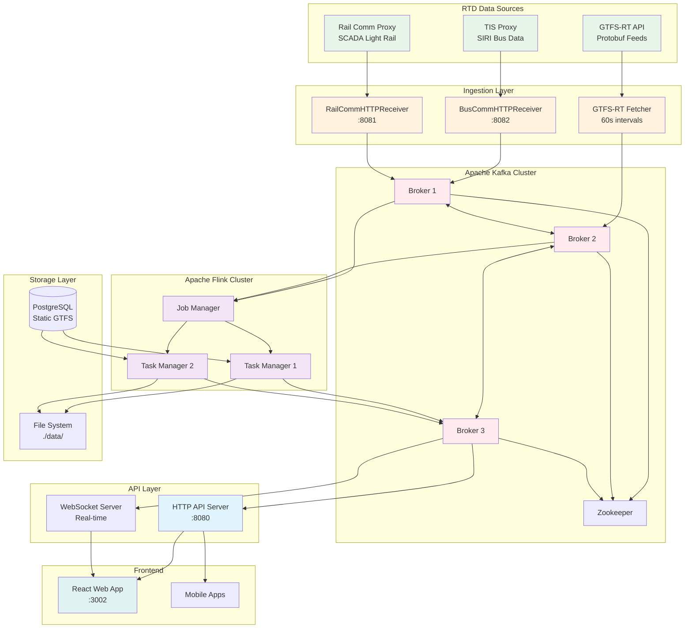

---

## Summary

**Kafka** acts as the durable message bus connecting:
- HTTP receivers (data ingestion) → Raw Kafka topics
- Raw topics → Flink processors → Processed topics
- Processed topics → API servers, dashboards, data warehouses

**Flink** provides intelligent stream processing:
- Format conversion (XML→JSON for SIRI)
- Data enrichment (joining with GTFS static data)
- Real-time calculations (delays, aggregations, anomalies)
- Multiple output formats (files, console, Kafka topics)

The architecture decouples data collection from processing, enabling scalability, fault tolerance, and real-time analytics for RTD's transit system.
