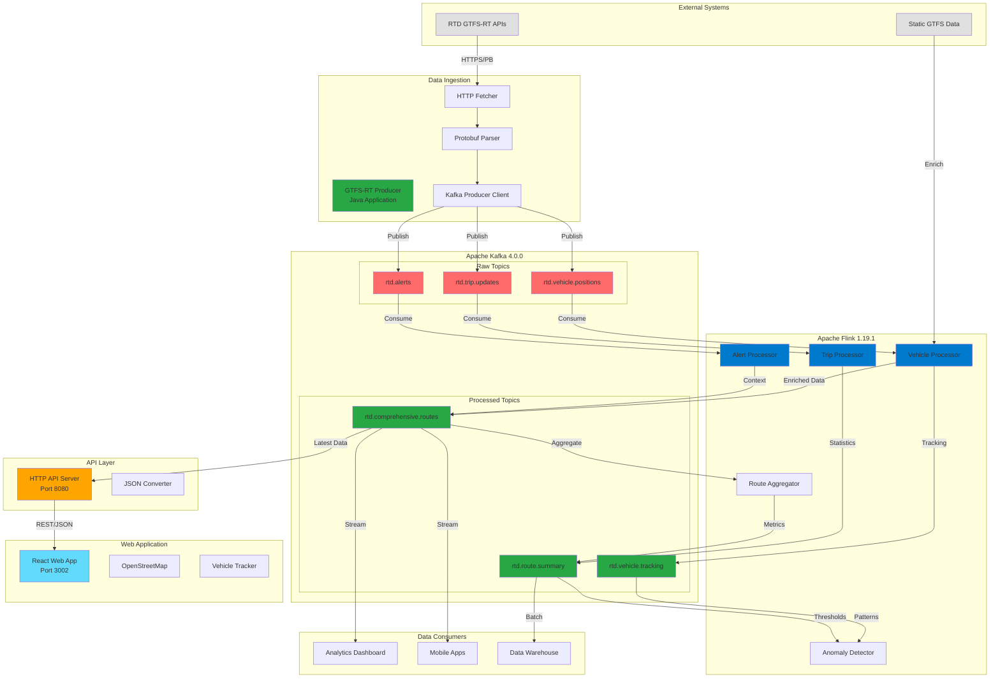
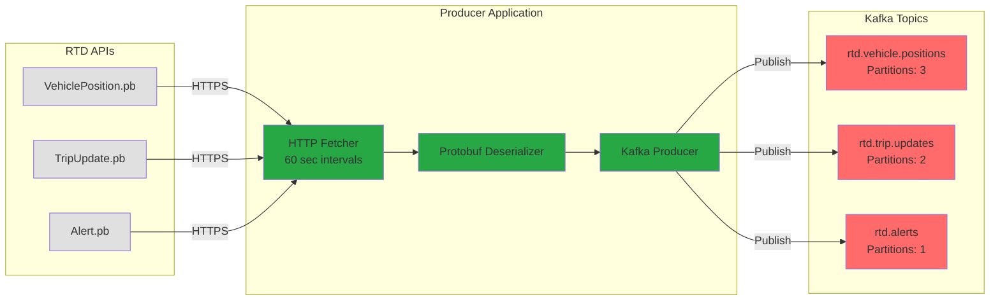
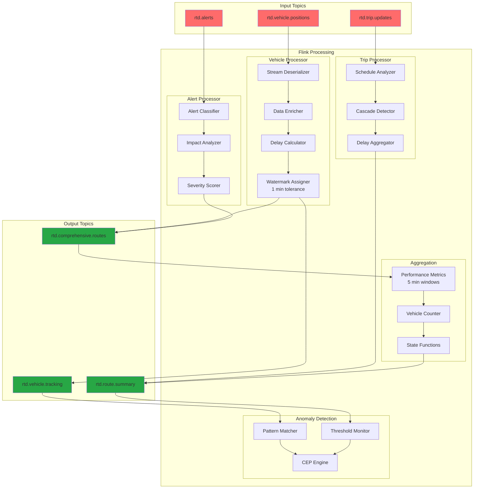
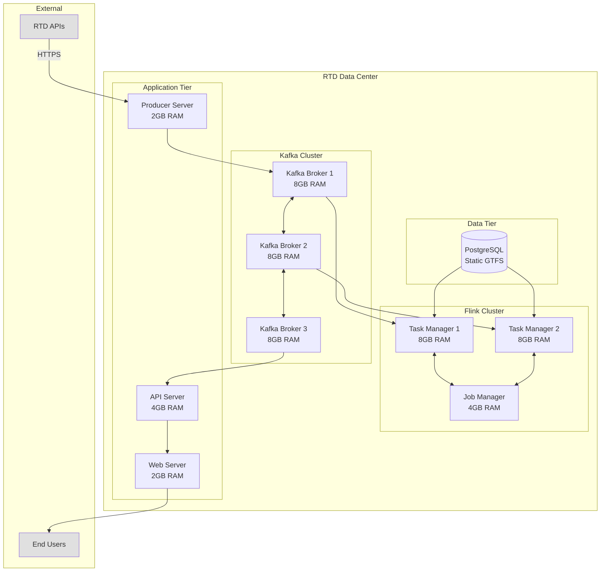

# RTD GTFS-RT Pipeline Architecture

## System Component Diagrams

This document provides detailed architectural diagrams of the RTD GTFS-RT data pipeline showing the integration between Apache Kafka and Apache Flink for real-time transit data processing.

## High-Level Architecture Overview



## Detailed Component Architecture

### 1. Data Ingestion Layer



### 2. Stream Processing Layer (Flink)



### 3. API and Web Layer

```mermaid
graph LR
    subgraph "Kafka Topics"
        CR[rtd.comprehensive.routes]
    end
    
    subgraph "HTTP API Server"
        CON[Kafka Consumer]
        VE[/api/vehicles]
        HE[/api/health]
        JS[JSON Converter]
        CORS[CORS Handler]
        
        CON --> JS
        JS --> VE
        JS --> HE
        CORS --> VE
        CORS --> HE
    end
    
    subgraph "React Application"
        DS[RTD Data Service]
        MAP[OpenStreetMap View]
        SEL[Vehicle Selector]
        TRK[Vehicle Tracker]
        QRY[Query Tools]
        
        DS --> MAP
        DS --> SEL
        DS --> TRK
        DS --> QRY
    end
    
    CR -->|Consume| CON
    VE -->|REST| DS
    HE -->|Health Check| DS
    
    style CR fill:#28a745
    style CON fill:#ffa500
    style VE fill:#ffa500
    style HE fill:#ffa500
    style DS fill:#61dafb
    style MAP fill:#61dafb
```

## Data Flow Stages

### Stage 1: Data Ingestion (Kafka)
- **Frequency**: Every 60 seconds
- **Volume**: ~400+ vehicles per fetch
- **Format**: Protocol Buffer (binary)
- **Topics**: 
  - `rtd.vehicle.positions` - GPS and status data
  - `rtd.trip.updates` - Schedule adherence
  - `rtd.alerts` - Service disruptions

### Stage 2: Stream Processing (Flink)
- **Deserialization**: Protocol Buffers → Java POJOs
- **Enrichment**: Join with static GTFS data
- **Calculations**:
  - Schedule delay computation
  - Route aggregations
  - On-time performance metrics
- **Pattern Detection**:
  - Service anomalies
  - Cascading delays
  - Historical patterns

### Stage 3: Data Distribution (Kafka)
- **Format**: Enriched JSON
- **Topics**:
  - `rtd.comprehensive.routes` - Complete vehicle/route data
  - `rtd.route.summary` - Aggregated statistics
  - `rtd.vehicle.tracking` - Enhanced monitoring data
- **Consumers**:
  - Real-time dashboards
  - Mobile applications
  - Operations monitoring systems
  - Data warehouse (historical analysis)

## Production Kafka Topics

| Topic Name | Purpose | Partitions | Retention | Format |
|------------|---------|------------|-----------|---------|
| `rtd.vehicle.positions` | Raw vehicle GPS data | 3 | 24 hours | Protobuf |
| `rtd.trip.updates` | Schedule adherence info | 2 | 24 hours | Protobuf |
| `rtd.alerts` | Service disruption alerts | 1 | 7 days | Protobuf |
| `rtd.comprehensive.routes` | Enriched vehicle data | 3 | 12 hours | JSON |
| `rtd.route.summary` | Route-level metrics | 1 | 24 hours | JSON |
| `rtd.vehicle.tracking` | Vehicle monitoring data | 2 | 6 hours | JSON |

## Key Architecture Benefits

### Scalability
- **Horizontal Scaling**: Kafka partitions and Flink parallelism
- **Load Distribution**: Multiple brokers and task managers
- **Elastic Processing**: Auto-scaling based on load

### Fault Tolerance
- **Message Durability**: Kafka replication factor of 3
- **Exactly-Once Semantics**: Flink checkpointing
- **Automatic Recovery**: State restoration from checkpoints

### Real-Time Processing
- **Low Latency**: < 1 second end-to-end processing
- **Event Time Processing**: Handles out-of-order data
- **Windowing**: Time-based aggregations and patterns

### Flexibility
- **Decoupled Architecture**: Producers and consumers operate independently
- **Multiple Data Formats**: Support for Protobuf, JSON, Avro
- **Extensible Processing**: Easy to add new stream processors

## Deployment Architecture



## Usage Instructions

### Viewing Structurizr Diagrams

The Structurizr DSL file (`rtd-pipeline-structurizr.dsl`) can be viewed using:

1. **Structurizr Lite** (Local):
   ```bash
   docker run -it --rm -p 8080:8080 \
     -v $(pwd)/architecture:/usr/local/structurizr \
     structurizr/lite
   ```
   Then navigate to http://localhost:8080

2. **Structurizr Online**:
   - Upload the DSL file to https://structurizr.com/

### Viewing PlantUML Diagrams

The PlantUML file (`rtd-pipeline-components.puml`) can be rendered using:

1. **PlantUML Server**:
   - Visit http://www.plantuml.com/plantuml/uml/
   - Paste the content

2. **VS Code Extension**:
   - Install PlantUML extension
   - Open the `.puml` file
   - Use `Alt+D` to preview

3. **Command Line**:
   ```bash
   java -jar plantuml.jar rtd-pipeline-components.puml
   ```

### Viewing Mermaid Diagrams

The Mermaid diagrams in this markdown file can be viewed:

1. **GitHub**: Automatically renders in README files
2. **VS Code**: Install Markdown Preview Mermaid Support
3. **Online**: Use https://mermaid.live/

## Architecture Decision Records

### ADR-001: Kafka as Message Bus
**Decision**: Use Apache Kafka 4.0.0 for message queuing
**Rationale**: 
- High throughput for real-time data
- Built-in partitioning for scalability
- Durable message storage
- Strong ecosystem support

### ADR-002: Flink for Stream Processing
**Decision**: Use Apache Flink 1.19.1 for stream processing
**Rationale**:
- True stream processing (not micro-batching)
- Exactly-once semantics
- Rich windowing functions
- Complex event processing capabilities

### ADR-003: Protocol Buffers for Data Format
**Decision**: Use Protocol Buffers for GTFS-RT data
**Rationale**:
- Industry standard for transit data
- Efficient binary serialization
- Strong typing and schema evolution
- Native support in RTD APIs

### ADR-004: React for Web Frontend
**Decision**: Use React with TypeScript for web application
**Rationale**:
- Component-based architecture
- Strong typing with TypeScript
- Rich ecosystem for mapping (Leaflet)
- Real-time data update capabilities

## Performance Metrics

- **Data Ingestion Rate**: ~400 vehicles/minute
- **Processing Latency**: < 1 second end-to-end
- **API Response Time**: < 100ms for vehicle queries
- **Dashboard Update Rate**: 30-second intervals
- **System Availability**: 99.9% uptime target

This architecture provides a robust, scalable foundation for real-time transit data processing, capable of handling the demands of modern public transportation systems.